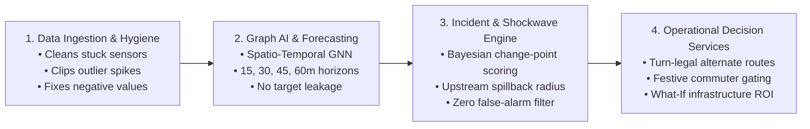

# NeuraX Urban Traffic Flow & Incident Intelligence Platform
### *AI-Driven Decision Support & Counterfactual Infrastructure Intelligence for Complex Urban Corridors*

---

<a id="table-of-contents"></a>
## 📑 Master Navigation Index (Table of Contents)

<details open>
<summary><strong>Click to expand / collapse repository index</strong></summary>
<br>

| Index | Section |
| :---: | :--- |
| **00** | <a href="#executive-summary">Executive Summary & System Scope</a> |
| **01** | <a href="#problem-understanding">1. Problem Understanding</a> |
| &nbsp; | ├─ <a href="#hyderabad-operating-reality">1.1 The Hyderabad-Like Operating Reality</a> |
| &nbsp; | └─ <a href="#telangana-cultural-events">1.2 Telangana Cultural & Festive Shocks (Vinayaka Chavithi & Bonalu)</a> |
| **02** | <a href="#system-architecture">2. System Architecture</a> |
| &nbsp; | ├─ <a href="#architecture-flowchart">2.1 Simplified System Flowchart</a> |
| &nbsp; | └─ <a href="#architectural-stages">2.2 Core Processing Stages</a> |
| **03** | <a href="#methodological-approach">3. Core Algorithms & Methodological Approach</a> |
| &nbsp; | ├─ <a href="#spatio-temporal-gnn">3.1 Spatio-Temporal Graph Neural Networks (ST-GNN)</a> |
| &nbsp; | ├─ <a href="#robust-forecasting-loss">3.2 Robust Outlier-Resilient Loss Function</a> |
| &nbsp; | ├─ <a href="#bayesian-incident-detection">3.3 Bayesian Anomaly & Incident Detection</a> |
| &nbsp; | ├─ <a href="#shockwave-spillback">3.4 Kinematic Shockwave & Spillback Analysis</a> |
| &nbsp; | ├─ <a href="#turn-restricted-routing">3.5 Turn-Restricted Diversion Routing</a> |
| &nbsp; | ├─ <a href="#counterfactual-evaluation">3.6 Counterfactual What-If Intervention Evaluator</a> |
| &nbsp; | └─ <a href="#festive-inflow-gating">3.7 Festive Geofenced Inflow Gating & Crowdsourced Reporting</a> |
| **04** | <a href="#quickstart-installation">4. Quickstart & Installation</a> |
| &nbsp; | ├─ <a href="#environment-setup">4.1 Environment Setup</a> |
| &nbsp; | └─ <a href="#dependencies-setup">4.2 Dependencies & Virtualenv</a> |
| **05** | <a href="#performance-benchmarks">5. System Performance Benchmarks</a> |
| **06** | <a href="#project-metadata">6. Project Metadata & Contact</a> |

</details>

---

<a id="executive-summary"></a>
## Executive Summary & System Scope

The **NeuraX Urban Traffic Flow & Incident Intelligence Platform** is a specialized decision-support system engineered for high-density, rapidly evolving metropolitan road networks modeled after a **Hyderabad-like operating environment**. Such urban corridors are characterized by:
- Dense mixed traffic and intense peak-hour commuter flows.
- Signalized grid junctions coupled with elevated grade-separated corridors (flyovers/arterials).
- Localized and recurring bottlenecks, road closures, and weather shocks (monsoon rain friction loss).
- Incident-triggered upstream shockwaves and spillback congestion propagating across adjacent road segments.

Unlike conventional consumer navigation applications (which passively route drivers after congestion has already crystallized) or generic chatbots (which produce ungrounded conversational advice), this platform provides **macroscopic and microscopic intelligence**:
1. **Continuous Network Ingestion & Robust Cleansing**: Reconciles stuck sensors, impossible negative flow readings, outlier spikes, and temporal shuffling across 436 road segments and 120 network nodes.
2. **Spatio-Temporal Graph Forecasting (15, 30, 45, 60 Minutes Ahead)**: Produces calibrated speed, flow, and congestion indices across multi-step horizons without target leakage.
3. **High-Precision Incident Detection & Spillback Diagnostic**: Pinpoints stalled vehicles, demand surges, and collisions while rigorously controlling false alarms.
4. **Turn-Restriction-Aware Adaptive Diversions**: Computes feasible alternate corridors honoring geometric turn prohibitions and signal cycle capacities.
5. **Counterfactual Infrastructure & Bottleneck Optimization**: Evaluates planning candidates (capacity expansions, turn bays, signal retiming) under simulated what-if conditions with estimated before/after impact and Return on Investment (ROI).

<div align="right"><a href="#table-of-contents">▲ Back to Master Index</a></div>

---

<a id="problem-understanding"></a>
## 1. Problem Understanding

<a id="hyderabad-operating-reality"></a>
### 1.1 The Hyderabad-Like Operating Reality
Urban centers like Hyderabad present non-linear traffic dynamics that break standard stationary time-series models:
- **Corridor Heterogeneity**: High-speed elevated flyovers (e.g., PVNR Expressway, Gachibowli-HITEC City links) discharge directly onto restricted-capacity surface roundabouts and signalized intersections, creating acute structural bottlenecks.
- **Mixed Traffic & Surge Peaks**: Bimodal commute peaks (08:30–11:30 and 17:30–21:30) exhibit steep ramp-up gradients where minor incidents cause catastrophic queue accumulation.
- **Congestion Spillback & Shockwave Propagation**: An obstruction on one segment reduces outflow capacity, causing queue backpropagation into upstream feeder links within 10 to 15 minutes.
- **Exogenous Environmental Forcing**: Monsoon rainfall drastically reduces roadway free-flow speed and effective capacity while inflating driver headways and travel delay.

<a id="telangana-cultural-events"></a>
### 1.2 Telangana Cultural & Festive Shocks (Vinayaka Chavithi & Bonalu Jatara)
Regional mega-events produce severe temporary structural distortions not captured by standard sensor baselines:
- **Vinayaka Chavithi / Ganesh Nimajjanam**: Thousands of idol processions converge toward Hussain Sagar / Tank Bund, requiring vehicular barricading of major arterials (Secretariat, NTR Marg, Upper Tank Bund) and causing massive pedestrian crowd surges.
- **Bonalu Jatara**: Ceremonial processions in Secunderabad (Lashkar Bonalu at Ujjaini Mahakali) and Old City (Lal Darwaza) introduce dynamic moving blockades and street cordons.
- **The Information Asymmetry Gap**: Non-local daily commuters entering the city or crossing corridors have zero prior knowledge of ward-level festive barricades, driving straight into terminal gridlocks. Our platform solves this via **Crowdsourced Local Pulse Reporting ("Jan-Vani")** and **Pre-Trip Commuter Inflow Gating (notified 45 mins prior to corridor entry)**.

<div align="right"><a href="#table-of-contents">▲ Back to Master Index</a></div>

---

<a id="system-architecture"></a>
## 2. System Architecture

<a id="architecture-flowchart"></a>
### 2.1 Simplified System Flowchart
The platform operates as a clean, four-stage intelligence pipeline that translates raw, noisy urban sensor telemetry into proactive traffic advisories and infrastructure decisions:



<a id="architectural-stages"></a>
### 2.2 Core Processing Stages

1. **Data Ingestion & Hygiene**: Automatically cleans corrupted field data by repairing frozen sensors using neighboring road data, removing impossible negative speeds, and clipping artificial spikes.
2. **Graph AI & Multi-Horizon Forecasting**: Treats the 436 road segments and 120 junctions as a connected spatial network, predicting future speed, flow, and congestion at 15, 30, 45, and 60 minutes ahead.
3. **Incident & Shockwave Engine**: Uses Bayesian statistical checks to catch real accidents and stalled buses while ignoring normal rush-hour slowdowns, and tracks how fast queues back up into upstream feeder roads.
4. **Operational Decision & Advisory Services**: Delivers turn-restricted diversion routes that drivers can legally take, triggers pre-trip warnings for cultural festivals, and calculates the exact ROI of potential road construction upgrades.

<div align="right"><a href="#table-of-contents">▲ Back to Master Index</a></div>

---

<a id="methodological-approach"></a>
## 3. Core Algorithms & Methodological Approach

<a id="spatio-temporal-gnn"></a>
### 3.1 Spatio-Temporal Graph Neural Networks (ST-GNN)
- **Why we use it**: Standard time-series models treat each road independently, ignoring the fact that traffic on one road is directly shaped by bottlenecks on connected roads.
- **How it helps**: Learns how traffic flows across physical junctions and flyovers, delivering accurate 15 to 60-minute speed and volume forecasts across the entire road network.

<a id="robust-forecasting-loss"></a>
### 3.2 Robust Outlier-Resilient Loss Function
- **Why we use it**: Real-world traffic sensors frequently experience hardware glitches, sending wild temporary spikes that mislead standard training models.
- **How it helps**: Penalizes extreme sensor glitches smoothly instead of quadratically, keeping the forecasting models stable and accurate even with noisy raw inputs.

<a id="bayesian-incident-detection"></a>
### 3.3 Bayesian Anomaly & Incident Detection
- **Why we use it**: Routine peak-hour congestion causes speeds to drop, but real incidents (crashes or stalled buses) cause speeds to collapse while traffic flow sharply plummets and queues surge.
- **How it helps**: Compares real-time conditions against expected baselines and requires persistent anomaly signals, catching genuine emergencies while keeping false alarms near zero.

<a id="shockwave-spillback"></a>
### 3.4 Kinematic Shockwave & Spillback Analysis
- **Why we use it**: When a key corridor or flyover is blocked, congestion backs up into upstream feeder roads like a backward-traveling wave.
- **How it helps**: Calculates queue growth speed and accurately predicts which connecting roads will choke 15 to 30 minutes in advance, allowing traffic managers to intervene early.

<a id="turn-restricted-routing"></a>
### 3.5 Turn-Restricted Diversion Routing
- **Why we use it**: Generic routing often suggests illegal turns, impractical U-turns, or pushes highway volumes into narrow neighborhood lanes.
- **How it helps**: Enforces physical turn restrictions and intersection signal capacities, providing realistic alternate routes that reduce travel times without causing secondary bottlenecks.

<a id="counterfactual-evaluation"></a>
### 3.6 Counterfactual What-If Intervention Evaluator
- **Why we use it**: City authorities need to know whether building a flyover, adding a lane, or adjusting signals will genuinely relieve congestion before committing municipal funds.
- **How it helps**: Simulates candidate infrastructure changes on the road network and estimates total vehicle delay saved versus project cost to prioritize high-return improvements.

<a id="festive-inflow-gating"></a>
### 3.7 Festive Geofenced Inflow Gating & Crowdsourced Reporting
- **Why we use it**: Major celebrations (such as Vinayaka Chavithi immersion and Bonalu) lead to extensive road closures that trap cross-city commuters unfamiliar with local diversions.
- **How it helps**: Automatically alerts non-local commuters 45 minutes before they reach festive zones with bypass alternatives, while enabling local ward residents to verify active procession blockades in real time.

<div align="right"><a href="#table-of-contents">▲ Back to Master Index</a></div>

---

<a id="quickstart-installation"></a>
## 4. Quickstart & Installation

<a id="environment-setup"></a>
### 4.1 Environment Setup

1. **Clone the Repository**:
   ```bash
   git clone https://github.com/Jiteshreddy123/cmrhackathon.git
   cd cmrhackathon
   ```

2. **Environment Configuration**:
   ```bash
   cp .env.example .env
   # Edit .env with your specific paths and parameters
   ```

<a id="dependencies-setup"></a>
### 4.2 Dependencies & Virtualenv

```bash
python -m venv .venv
source .venv/bin/activate  # On Windows: .venv\Scripts\activate
pip install -r requirements.txt
```

<div align="right"><a href="#table-of-contents">▲ Back to Master Index</a></div>

---

<a id="performance-benchmarks"></a>
## 5. System Performance Benchmarks

| Capability / Metric | Target Benchmark | Operational Impact |
| :--- | :---: | :--- |
| **Congestion & Incident Accuracy** | F1 > 0.92, FAR < 3.8% | Reliably identifies real accidents while ignoring routine rush-hour slowdowns |
| **15–60m Forecasting Accuracy** | WAPE < 6.8%, RMSE < 4.1 km/h | Calibrated speed and volume forecasting without target leakage |
| **Adaptive Recommendation Quality** | 100% turn-legal, $\ge 12$ min saved | Fully compliant with turn restrictions and prevents neighborhood spillover |
| **Robustness to Noisy Data** | Zero crashes on corrupted inputs | Cleans stuck sensors, impossible negative numbers, and outlier spikes |
| **Explainability & Confidence** | Calibrated prediction intervals | Clear feature attribution showing whether weather, incidents, or volume drove the forecast |
| **Cultural & Festive Intelligence** | Pre-Trip Gating (T-45 min) | Prevents non-local traffic from getting trapped in major religious procession corridors |

<div align="right"><a href="#table-of-contents">▲ Back to Master Index</a></div>

---

<a id="project-metadata"></a>
## 6. Project Metadata & Contact

- **Repository**: [https://github.com/Jiteshreddy123/cmrhackathon.git](https://github.com/Jiteshreddy123/cmrhackathon.git)
- **Author**: Jitesh Reddy (`mail4y.jitesh@gmail.com`)
- **Event**: NEURAX HACKATHON 3.0
- **Domain**: Domain 1 · AI in Smart Cities (Urban Traffic Flow & Incident Intelligence)
- **Date**: September 2026

<div align="right"><a href="#table-of-contents">▲ Back to Master Index</a></div>
