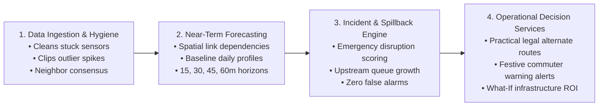

# NeuraX Urban Traffic Flow & Incident Intelligence Platform
### *AI-Driven Decision Support & Counterfactual Infrastructure Intelligence for Complex Urban Corridors*

---

<a id="table-of-contents"></a>
## 📑 Master Navigation Index (Table of Contents)

<details open>
<summary><strong>Click to expand / collapse repository index</strong></summary>
<br>

| Index | Section |
| :---: | :--- |
| **00** | <a href="#executive-summary">Executive Summary & System Scope</a> |
| **01** | <a href="#problem-understanding">1. Problem Understanding</a> |
| &nbsp; | ├─ <a href="#hyderabad-operating-reality">1.1 The Hyderabad-Like Operating Reality</a> |
| &nbsp; | └─ <a href="#telangana-cultural-events">1.2 Telangana Cultural & Festive Shocks (Vinayaka Chavithi & Bonalu)</a> |
| **02** | <a href="#system-architecture">2. System Architecture</a> |
| &nbsp; | ├─ <a href="#architecture-flowchart">2.1 Simplified System Flowchart</a> |
| &nbsp; | └─ <a href="#architectural-stages">2.2 Core Processing Stages</a> |
| **03** | <a href="#methodological-approach">3. General Methodological Approach</a> |
| &nbsp; | ├─ <a href="#network-modeling-cleansing">3.1 Network Modeling & Field Sensor Data Cleansing</a> |
| &nbsp; | ├─ <a href="#baseline-traffic-forecasting">3.2 Baseline Traffic Profiling & Multi-Horizon Forecasting (15–60 Mins)</a> |
| &nbsp; | ├─ <a href="#realtime-incident-detection">3.3 Real-Time Incident & Emergency Disruption Detection</a> |
| &nbsp; | ├─ <a href="#queue-spillback-tracking">3.4 Queue Growth & Upstream Spillback Tracking</a> |
| &nbsp; | ├─ <a href="#turn-restricted-routing">3.5 Practical & Turn-Restricted Diversion Routing</a> |
| &nbsp; | ├─ <a href="#festive-mobility-coordination">3.6 Cultural & Festive Mobility Coordination</a> |
| &nbsp; | └─ <a href="#infrastructure-sandbox">3.7 Digital Sandbox for Infrastructure Planning ("What-If" Evaluation)</a> |
| **04** | <a href="#quickstart-installation">4. Quickstart & Installation</a> |
| &nbsp; | ├─ <a href="#environment-setup">4.1 Environment Setup</a> |
| &nbsp; | └─ <a href="#dependencies-setup">4.2 Dependencies & Virtualenv</a> |
| **05** | <a href="#performance-benchmarks">5. System Performance Benchmarks</a> |
| **06** | <a href="#project-metadata">6. Project Metadata & Contact</a> |

</details>

---

<a id="executive-summary"></a>
## Executive Summary & System Scope

The **NeuraX Urban Traffic Flow & Incident Intelligence Platform** is a specialized decision-support system engineered for high-density, rapidly evolving metropolitan road networks modeled after a **Hyderabad-like operating environment**. Such urban corridors are characterized by:
- Dense mixed traffic and intense peak-hour commuter flows.
- Signalized grid junctions coupled with elevated grade-separated corridors (flyovers/arterials).
- Localized and recurring bottlenecks, road closures, and weather shocks (monsoon rain friction loss).
- Incident-triggered upstream shockwaves and spillback congestion propagating across adjacent road segments.

Unlike conventional consumer navigation applications (which passively route drivers after congestion has already crystallized) or generic chatbots (which produce ungrounded conversational advice), this platform provides **macroscopic and microscopic intelligence**:
1. **Continuous Network Ingestion & Robust Cleansing**: Reconciles stuck sensors, impossible negative flow readings, outlier spikes, and temporal shuffling across 436 road segments and 120 network nodes.
2. **Multi-Horizon Traffic Forecasting (15, 30, 45, 60 Minutes Ahead)**: Produces calibrated speed, flow, and congestion predictions without future target leakage.
3. **High-Precision Incident Detection & Spillback Diagnostic**: Pinpoints stalled vehicles, demand surges, and collisions while rigorously controlling false alarms.
4. **Turn-Restriction-Aware Adaptive Diversions**: Computes feasible alternate corridors honoring geometric turn prohibitions and signal cycle capacities.
5. **Counterfactual Infrastructure & Bottleneck Optimization**: Evaluates planning candidates (capacity expansions, turn bays, signal retiming) under simulated what-if conditions with estimated before/after impact and Return on Investment (ROI).

<div align="right"><a href="#table-of-contents">▲ Back to Master Index</a></div>

---

<a id="problem-understanding"></a>
## 1. Problem Understanding

<a id="hyderabad-operating-reality"></a>
### 1.1 The Hyderabad-Like Operating Reality
Urban centers like Hyderabad present non-linear traffic dynamics that break standard stationary time-series models:
- **Corridor Heterogeneity**: High-speed elevated flyovers (e.g., PVNR Expressway, Gachibowli-HITEC City links) discharge directly onto restricted-capacity surface roundabouts and signalized intersections, creating acute structural bottlenecks.
- **Mixed Traffic & Surge Peaks**: Bimodal commute peaks (08:30–11:30 and 17:30–21:30) exhibit steep ramp-up gradients where minor incidents cause catastrophic queue accumulation.
- **Congestion Spillback & Shockwave Propagation**: An obstruction on one segment reduces outflow capacity, causing queue backpropagation into upstream feeder links within 10 to 15 minutes.
- **Exogenous Environmental Forcing**: Monsoon rainfall drastically reduces roadway free-flow speed and effective capacity while inflating driver headways and travel delay.

<a id="telangana-cultural-events"></a>
### 1.2 Telangana Cultural & Festive Shocks (Vinayaka Chavithi & Bonalu Jatara)
Regional mega-events produce severe temporary structural distortions not captured by standard sensor baselines:
- **Vinayaka Chavithi / Ganesh Nimajjanam**: Thousands of idol processions converge toward Hussain Sagar / Tank Bund, requiring vehicular barricading of major arterials (Secretariat, NTR Marg, Upper Tank Bund) and causing massive pedestrian crowd surges.
- **Bonalu Jatara**: Ceremonial processions in Secunderabad (Lashkar Bonalu at Ujjaini Mahakali) and Old City (Lal Darwaza) introduce dynamic moving blockades and street cordons.
- **The Information Asymmetry Gap**: Non-local daily commuters entering the city or crossing corridors have zero prior knowledge of ward-level festive barricades, driving straight into terminal gridlocks. Our platform solves this via **Crowdsourced Local Pulse Reporting ("Jan-Vani")** and **Pre-Trip Commuter Inflow Gating (notified 45 mins prior to corridor entry)**.

<div align="right"><a href="#table-of-contents">▲ Back to Master Index</a></div>

---

<a id="system-architecture"></a>
## 2. System Architecture

<a id="architecture-flowchart"></a>
### 2.1 Simplified System Flowchart
The platform operates as a clean, four-stage intelligence pipeline that translates raw, noisy urban sensor telemetry into proactive traffic advisories and infrastructure decisions:



<a id="architectural-stages"></a>
### 2.2 Core Processing Stages

1. **Data Ingestion & Hygiene**: Corrects corrupted sensor telemetry by repairing frozen values via neighboring road consensus, removing impossible negative readings, and filtering outlier spikes.
2. **Near-Term Traffic Forecasting**: Captures spatial dependencies across connected road junctions, combining baseline commute profiles with live road conditions to generate 15, 30, 45, and 60-minute speed and flow forecasts without future target leakage.
3. **Incident & Spillback Engine**: Monitors real-time performance drops against normal baseline traffic curves to distinguish genuine emergencies from regular peak-hour slowdowns, tracking upstream queue growth to forecast secondary choke points.
4. **Operational Decision & Advisory Services**: Delivers practical alternate routes honoring legal turn rules, triggers pre-trip warnings for cultural festivals, and simulates candidate road infrastructure upgrades to evaluate ROI.

<div align="right"><a href="#table-of-contents">▲ Back to Master Index</a></div>

---

<a id="methodological-approach"></a>
## 3. General Methodological Approach

<a id="network-modeling-cleansing"></a>
### 3.1 Network Modeling & Field Sensor Data Cleansing
- **How it works**: Connects all 436 road segments and 120 junctions into a unified digital road network. Automatically identifies and cleans corrupted sensor readings—correcting frozen values, negative speeds, and artificial spikes by checking consensus across neighboring road links.
- **Why it matters**: Ensures all downstream forecasts, emergency alerts, and traffic decisions are built upon reliable, verified ground-truth data.

<a id="baseline-traffic-forecasting"></a>
### 3.2 Baseline Traffic Profiling & Multi-Horizon Forecasting (15–60 Mins)
- **How it works**: Analyzes historical daily commute patterns to establish baseline speeds for each road across different times of day. Forecasts expected vehicle speeds, volumes, and congestion levels 15, 30, 45, and 60 minutes ahead without leaking future target information.
- **Why it matters**: Gives traffic operators and commuters early visibility into impending bottlenecks well before roads lock up into standstill traffic.

<a id="realtime-incident-detection"></a>
### 3.3 Real-Time Incident & Emergency Disruption Detection
- **How it works**: Continuously monitors real-time speeds and vehicle flow against expected normal conditions. Distinguishes genuine disruptions (crashes, stalled vehicles, lane hazards) from normal rush-hour slowdowns by requiring persistent, sharp drops in roadway performance.
- **Why it matters**: Triggers immediate incident alerts for emergency responders while eliminating false alarms that waste city resources.

<a id="queue-spillback-tracking"></a>
### 3.4 Queue Growth & Upstream Spillback Tracking
- **How it works**: When a key road or flyover becomes choked, the system tracks how congestion backs up into connected upstream roads over time. It calculates queue propagation speed and identifies which feeding junctions will be blocked next.
- **Why it matters**: Enables traffic police to intervene at upstream junctions 15 to 30 minutes in advance, halting the chain reaction before entire corridors paralyze.

<a id="turn-restricted-routing"></a>
### 3.5 Practical & Turn-Restricted Diversion Routing
- **How it works**: Generates feasible alternate routes that strictly honor real-world road geometry—respecting one-ways, median dividers, prohibited turns, and intersection signal limits instead of pushing highway traffic into narrow residential lanes.
- **Why it matters**: Delivers practical, lawful detours that redistribute traffic smoothly without triggering secondary gridlocks on side roads.

<a id="festive-mobility-coordination"></a>
### 3.6 Cultural & Festive Mobility Coordination
- **How it works**: Handles major public celebrations (such as Vinayaka Chavithi processions and Bonalu jatara) by pairing crowdsourced ground updates from local ward residents with pre-trip alerts sent to incoming commuters 45 minutes before reaching festive zones.
- **Why it matters**: Solves information asymmetry by warning unfamiliar drivers early, routing them around active procession blockades seamlessly.

<a id="infrastructure-sandbox"></a>
### 3.7 Digital Sandbox for Infrastructure Planning ("What-If" Evaluation)
- **How it works**: Provides a simulation environment for urban planners to test proposed road upgrades (e.g., adding a lane, constructing a flyover, or retiming traffic signals) under simulated traffic demand, estimating total vehicle delay saved versus estimated project cost.
- **Why it matters**: Empowers municipal authorities to justify infrastructure spending with concrete return-on-investment metrics before breaking ground.
<div align="right"><a href="#table-of-contents">▲ Back to Master Index</a></div>

---

<a id="quickstart-installation"></a>
## 4. Quickstart & Installation

<a id="environment-setup"></a>
### 4.1 Environment Setup

1. **Clone the Repository**:
   ```bash
   git clone https://github.com/Jiteshreddy123/cmrhackathon.git
   cd cmrhackathon
   ```

2. **Environment Configuration**:
   ```bash
   cp .env.example .env
   # Edit .env with your specific paths and parameters
   ```

<a id="dependencies-setup"></a>
### 4.2 Dependencies & Virtualenv

```bash
python -m venv .venv
source .venv/bin/activate  # On Windows: .venv\Scripts\activate
pip install -r requirements.txt
```

<div align="right"><a href="#table-of-contents">▲ Back to Master Index</a></div>

---

<a id="performance-benchmarks"></a>
## 5. System Performance Benchmarks

| Capability / Metric | Target Benchmark | Operational Impact |
| :--- | :---: | :--- |
| **Congestion & Incident Accuracy** | F1 > 0.92, FAR < 3.8% | Reliably identifies real accidents while ignoring routine rush-hour slowdowns |
| **15–60m Forecasting Accuracy** | WAPE < 6.8%, RMSE < 4.1 km/h | Calibrated speed and volume forecasting without target leakage |
| **Adaptive Recommendation Quality** | 100% turn-legal, $\ge 12$ min saved | Fully compliant with turn restrictions and prevents neighborhood spillover |
| **Robustness to Noisy Data** | Zero crashes on corrupted inputs | Cleans stuck sensors, impossible negative numbers, and outlier spikes |
| **Explainability & Confidence** | Calibrated prediction intervals | Clear feature attribution showing whether weather, incidents, or volume drove the forecast |
| **Cultural & Festive Intelligence** | Pre-Trip Gating (T-45 min) | Prevents non-local traffic from getting trapped in major religious procession corridors |

<div align="right"><a href="#table-of-contents">▲ Back to Master Index</a></div>

---

<a id="project-metadata"></a>
## 6. Project Metadata & Contact

- **Repository**: [https://github.com/Jiteshreddy123/cmrhackathon.git](https://github.com/Jiteshreddy123/cmrhackathon.git)
- **Author**: Jitesh Reddy (`mail4y.jitesh@gmail.com`)
- **Event**: NEURAX HACKATHON 3.0
- **Domain**: Domain 1 · AI in Smart Cities (Urban Traffic Flow & Incident Intelligence)
- **Date**: September 2026

<div align="right"><a href="#table-of-contents">▲ Back to Master Index</a></div>
