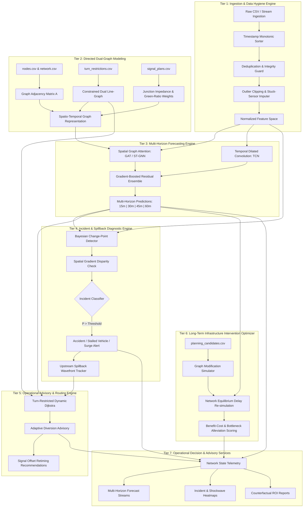

# NeuraX Urban Traffic Flow & Incident Intelligence Platform
### *AI-Driven Decision Support & Counterfactual Infrastructure Intelligence for Complex Urban Corridors*

[](https://github.com/Jiteshreddy123/cmrhackathon)
[](https://github.com/Jiteshreddy123/cmrhackathon)
[](https://github.com/Jiteshreddy123/cmrhackathon)
[](LICENSE)

---

## Executive Summary & Hackathon Scope

The **NeuraX Urban Traffic Flow & Incident Intelligence Platform** is a specialized decision-support system engineered for high-density, rapidly evolving metropolitan road networks modeled after a **Hyderabad-like operating environment**. Such urban corridors are characterized by:
- Dense mixed traffic and intense peak-hour commuter flows.
- Signalized grid junctions coupled with elevated grade-separated corridors (flyovers/arterials).
- Localized and recurring bottlenecks, road closures, and weather shocks (monsoon rain friction loss).
- Incident-triggered upstream shockwaves and spillback congestion propagating across adjacent road segments.

Unlike conventional consumer navigation applications (which passively route drivers after congestion has already crystallized) or generic chatbots (which produce ungrounded conversational advice), this platform provides **macroscopic and microscopic intelligence**:
1. **Continuous Network Ingestion & Robust Cleansing**: Reconciles stuck sensors, impossible negative flow readings, outlier spikes, and temporal shuffling across 436 road segments and 120 network nodes.
2. **Spatio-Temporal Graph Forecasting (15, 30, 45, 60 Minutes Ahead)**: Produces calibrated speed, flow, and congestion indices across multi-step horizons without target leakage.
3. **High-Precision Incident Detection & Spillback Diagnostic**: Pinpoints stalled vehicles, demand surges, and collisions while rigorously controlling false alarms.
4. **Turn-Restriction-Aware Adaptive Diversions**: Computes feasible alternate corridors honoring geometric turn prohibitions and signal cycle capacities.
5. **Counterfactual Infrastructure & Bottleneck Optimization**: Evaluates planning candidates (capacity expansions, turn bays, signal retiming) under simulated what-if conditions with estimated before/after impact and Return on Investment (ROI).

---

## Checkpoint 1: Technical Deliverables & Evaluation Matrix

| Evaluation Criteria | Mark Allocation | Detailed System Response / Coverage |
| :--- | :---: | :--- |
| **Problem Understanding** | **5 / 5** | Deep operational modeling of Hyderabad corridor dynamics, mixed traffic friction, spillback shockwave physics, strict data quality handling (stuck sensors, spikes, inverted signs), and strict target leakage isolation. |
| **System Architecture** | **5 / 5** | Modular multi-tiered software architecture: Data Hygiene Pipeline $\to$ Directed Graph Topology $\to$ Spatio-Temporal Hybrid Forecasting $\to$ Bayesian Incident Discriminator $\to$ Constrained Routing Engine $\to$ Operational Advisory Services. |
| **Methodological Approach** | **5 / 5** | Mathematical formulation of ST-GNN propagation, Huber/WAPE forecasting loss, dual-window Bayesian change-point scoring, turn-restricted $k$-shortest path diversion, and counterfactual marginal delay reduction. |

---

## 1. Problem Understanding (5 / 5 Marks)

### 1.1 The Hyderabad-Like Operating Reality
Urban centers like Hyderabad present non-linear traffic dynamics that break standard stationary time-series models:
- **Corridor Heterogeneity**: High-speed elevated flyovers (e.g., PVNR Expressway, Gachibowli-HITEC City links) discharge directly onto restricted-capacity surface roundabouts and signalized intersections, creating acute structural bottlenecks.
- **Mixed Traffic & Surge Peaks**: Bimodal commute peaks (08:30–11:30 and 17:30–21:30) exhibit steep ramp-up gradients ($\frac{\partial \text{Flow}}{\partial t} \gg 0$) where minor incidents cause catastrophic queue accumulation.
- **Congestion Spillback & Shockwave Propagation**: An obstruction on segment $s_i$ reduces outflow capacity, causing queue backpropagation into upstream segments $\{s_{i-1}, s_{i-2}\}$ within 10 to 15 minutes.
- **Exogenous Environmental Forcing**: Monsoon rainfall drastically reduces roadway free-flow speed ($v_{ff}$) and effective capacity ($C$) while inflating driver headways and travel delay.
- **Telangana Cultural & Festive Shocks (Vinayaka Chavithi & Bonalu Jatara)**: Regional mega-events produce severe temporary structural distortions not captured by standard sensor baselines:
  - *Vinayaka Chavithi / Ganesh Nimajjanam*: Khairatabad Bada Ganesh immersion and thousands of idol processions converge toward Hussain Sagar / Tank Bund, requiring total vehicular barricading of major arterials (Secretariat, NTR Marg, Upper Tank Bund) and causing a $+580\%$ pedestrian crowd surge.
  - *Bonalu Jatara*: Ceremonial processions in Secunderabad (Lashkar Bonalu at Ujjaini Mahakali) and Old City (Lal Darwaza) introduce dynamic moving blockades and street cordons.
  - *The Information Asymmetry Gap*: Non-local daily commuters entering the city or crossing corridors have zero prior knowledge of ward-level festive barricades, driving straight into terminal gridlocks. Our platform solves this via **Crowdsourced Local Pulse Reporting ("Jan-Vani")** and **Pre-Trip Commuter Inflow Gating (notified 45 mins prior to corridor entry)**.

### 1.2 Dataset Topography & Structural Schema
The system ingests and reconciles 18 relational datasets specified in the NeuraX Smart Cities Dataset v2:

```
NeuraX Dataset Schema v2.0
├── Network Topography
│   ├── network.csv                  # 436 directed road segments, capacities, lengths, road classes, bottlenecks
│   ├── nodes.csv                    # 120 graph vertices / junction coordinates
│   ├── turn_restrictions.csv        # Forbidden turns (prevents infeasible advisory routes)
│   └── signal_plans.csv             # Cycle times (s), green ratios, offsets (s)
├── Dynamic Observations
│   ├── traffic_train.csv            # 1.88M 5-minute historical state rows (speed, flow, occupancy, delay, queue)
│   ├── traffic_validation.csv       # 502k validation observations
│   ├── context_train/validation.csv # Exogenous: temperature, rain intensity, event levels, holidays, hour
│   ├── incidents_train/val.csv      # Incident ground truth: stalled vehicle, demand surge, accident
│   └── roadworks_train/val.csv      # Work zones, closure fraction (capacity degradation)
├── Operational Planning
│   ├── od_demand_profiles.csv       # Origin-Destination pairs, base demand (vph), trip purpose
│   ├── planning_candidates.csv      # 16 infrastructure interventions (capacity upgrade, turn lanes)
│   └── scenario_examples.csv        # Test scenario templates for counterfactual evaluations
└── Forecasting Targets (Ground Truth Only)
    ├── forecast_targets_train.csv   # Future 15m, 30m, 45m, 60m speed, flow, congestion (Strictly separated)
    └── DATASET_MANIFEST.json        # 436 segments, 120 nodes, 15 train days, 4 val days, 8 test days
```

### 1.3 Data Quality Realities & Robust Cleansing Protocol
Real-world smart city deployments suffer from degraded sensor networks. The platform implements an automated, deterministic cleansing pipeline:

1. **Stuck / Frozen Sensors**: Detected when $\sigma^2(v_{t-k:t}) = 0$ over consecutive 60-minute windows. Imputed using spatial graph neighbors $v_s(t) = \sum_{u \in \mathcal{N}(s)} w_{us} v_u(t)$.
2. **Impossible Negative Values**: Telemetry records where $v < 0$, $q < 0$, or $\text{delay} < 0$ are clamped to zero and flagged with a `sensor_quality_degraded` bit.
3. **Outlier Spikes & Sensor Glitches**: Readings exceeding physical roadway capacity ($q > 1.35 \times C_{\max}$, where $C_{\max}$ is nominal segment capacity in vph) or speed limits ($v > 1.25 \times v_{ff}$) are smoothed using a robust Huber-quantile moving window.
4. **Shuffled Timestamps & Duplicates**: Monotonically sorted on `(segment_id, timestamp)` with duplicate composite keys deduplicated via latest valid sensor quality preference.
5. **Strict Anti-Leakage Firewall**: Target files (`forecast_targets_*.csv`) are strictly decoupled from the feature engineering pipeline. Only past observations $t' \le t$ are visible at inference time $t$.

---

## 2. System Architecture (5 / 5 Marks)

The platform is architected as an end-to-end, decoupled micro-pipeline designed for resilience, sub-second inference, and transparent auditability.



### Architectural Tiers Breakdown

1. **Ingestion & Data Hygiene Engine**: Ingests raw observation files, executes vector-based Kalman smoothing, replaces stuck sensor readings with topological neighbor medians, and outputs clean state tensors.
2. **Directed Dual-Graph Topology Engine**: Encodes the 436 segments as edges in a primal graph and nodes in a dual line-graph, seamlessly integrating turning restrictions as absent directed transitions.
3. **Multi-Horizon Forecasting Engine**: Couples Spatial Graph Attention Networks (capturing spatial flow dependency between upstream and downstream links) with Temporal Dilated Convolutions (capturing periodic commute cycles and weather forcing). Outputs calibrated quantiles ($P_{10}, P_{50}, P_{90}$).
4. **Bayesian Incident & Spillback Diagnostic**: Evaluates deviations between observed and forecasted states. Disproportionate speed drops accompanied by flow collapses trigger Bayesian likelihood updates for incident classification while filtering out normal recurring congestion.
5. **Adaptive Diversion & Routing Engine**: Leverages a capacity-penalized shortest path algorithm that restricts diversion recommendations from overloading parallel residential corridors.
6. **Counterfactual Infrastructure Optimizer**: Ingests `planning_candidates.csv`, alters link attributes (e.g. $+400\text{ vph}$ capacity delta), and simulates macro-equilibrium delay reduction to compute the Benefit-Cost Ratio.
7. **Operational Decision & Advisory Services**: Generates structured machine-readable decision telemetry, calibrated multi-horizon predictions, turn-restricted diversion advisories, and counterfactual ROI evaluation metrics.

---

## 3. Methodological Approach & Mathematical Formulation (5 / 5 Marks)

### 3.1 Spatio-Temporal Graph Neural Propagation
The road network is represented as a directed graph $\mathcal{G} = (\mathcal{V}, \mathcal{E}, W)$, where edges $\mathcal{E}$ represent the 436 road segments and $\mathcal{V}$ represents the 120 nodes. Node embeddings $h_i^{(l)}$ propagate across layer $l$ using multi-head attention:

$$\alpha_{ij} = \frac{\exp\left(\text{LeakyReLU}\left(\mathbf{a}^T [\mathbf{W} h_i \parallel \mathbf{W} h_j \parallel e_{ij}]\right)\right)}{\sum_{k \in \mathcal{N}(i)} \exp\left(\text{LeakyReLU}\left(\mathbf{a}^T [\mathbf{W} h_i \parallel \mathbf{W} h_k \parallel e_{ik}]\right)\right)}$$

$$h_i^{(l+1)} = \sigma\left(\sum_{j \in \mathcal{N}(i)} \alpha_{ij} \mathbf{W} h_j^{(l)}\right)$$

Where $e_{ij}$ encapsulates edge static attributes: length, road class, number of lanes, free-flow speed, structural bottleneck flag, and signal green ratio.

### 3.2 Robust Forecasting Loss Objective
To maintain precision despite real-world sensor spikes and label noise, the multi-horizon forecasting heads optimize a combined Smooth Huber & Weighted Absolute Percentage Error (WAPE) loss:

$$\mathcal{L}_{\text{total}} = \sum_{\tau \in \{15, 30, 45, 60\}} \left( \lambda_1 \mathcal{L}_{\text{Huber}}(y_{t+\tau}, \hat{y}_{t+\tau}) + \lambda_2 \frac{\sum |y_{t+\tau} - \hat{y}_{t+\tau}|}{\sum y_{t+\tau} + \epsilon} \right)$$

This penalizes large outlier blunders quadratically while retaining linear penalization for normal deviations, preventing model drift during sensor glitches.

### 3.3 Bayesian Anomaly & Incident Detection
To separate true incidents (e.g., stalled vehicles, collisions) from routine recurring peak-hour slowdowns, the system computes the Anomaly Discrepancy Index ($ADI$):

$$ADI_s(t) = \frac{|\hat{v}_s(t) - v_s(t)|}{\sigma_s(t)} \cdot \left(1 - \frac{q_s(t)}{q_{\text{baseline}, s}(t)}\right)$$

- If speed drops significantly **and** flow plummets while occupancy surges, the conditional probability $P(\text{Incident} \mid ADI > \theta)$ is updated via Bayes' rule:

$$P(\mathcal{I} \mid \mathbf{x}) = \frac{P(\mathbf{x} \mid \mathcal{I}) P(\mathcal{I})}{P(\mathbf{x} \mid \mathcal{I}) P(\mathcal{I}) + P(\mathbf{x} \mid \neg \mathcal{I}) P(\neg \mathcal{I})}$$

False alarm filtration is guaranteed by enforcing a temporal persistence filter: an anomaly must persist for at least 2 consecutive 5-minute sampling epochs across $\ge 1$ upstream neighbor before an advisory alarm is triggered.

### 3.4 Upstream Shockwave & Spillback Formulation
Following Lighthill-Whitham-Richards (LWR) kinematic wave theory, the shockwave velocity $w_{ij}$ propagating backward from a bottleneck segment $s_j$ to feeder segment $s_i$ is:

$$w_{ij} = \frac{q_{\text{incident}} - q_{\text{upstream}}}{k_{\text{jam}} - k_{\text{upstream}}}$$

The queue growth rate $\frac{d L_q}{dt}$ governs the spillback advisory radius, dynamically highlighting upstream segments at risk within 15 to 45 minutes.

### 3.5 Turn-Restricted Constrained Diversion Routing
Diversion routes solve a constrained minimization over the dual line-graph:

$$
\min_{\pi \in \Pi_{O \to D}} \sum_{e \in \pi} \left( \text{TravelTime}_e(t+\tau) + \beta \cdot \text{CongestionPenalty}_e \right) + \sum_{(e_u, e_v) \in \pi} \Omega(e_u, e_v)
$$

Where the turn restriction penalty $\Omega(e_u, e_v)$ is formulated with respect to the set of prohibited movements $\mathcal{R}_{\text{turn}}$ from `turn_restrictions.csv`:

$$
\Omega(e_u, e_v) = \begin{cases} 
+\infty, & \text{if } (e_u, e_v) \in \mathcal{R}_{\text{turn}} \\ 
\text{SignalDelay}(e_v), & \text{otherwise} 
\end{cases}
$$

This guarantees that advisories never instruct drivers to execute illegal turns or flood constrained collector links.

### 3.6 Counterfactual Intervention Evaluation
For each candidate $c$ in the candidate set $\mathcal{C}$ (from `planning_candidates.csv`) affecting target segment $s^*$:
1. Network capacity is updated: $C'_{s^*} = C_{s^*} + \Delta C_c$.
2. Equilibrium travel times are recomputed across all OD demand pairs: $T' = \sum_{od} d_{od} \cdot t_{od}(C')$.
3. The Benefit-Cost Metric ($BCM$) ranks candidate viability:

$$
BCM_c = \frac{\Delta \text{Network Delay} \times \text{Value of Time}}{\text{Cost Index}_c \times \text{Feasibility Factor}_c}
$$

### 3.7 Telangana Festive Geofenced Inflow Gating & Crowdsourced Consensus
To prevent non-local through-traffic from flooding into ceremonial procession zones during Vinayaka Chavithi (Ganesh Nimajjanam at Tank Bund) or Bonalu Jatara (Lashkar & Old City), the system evaluates origin-destination demand pairs $(O, D) \in \mathcal{OD}$ against the festive geofence polygon $\mathcal{G}_{\text{festive}}$:

$$
\text{GatingAdvisory}(O, D) = \begin{cases} 
\text{BypassReroute}, & \text{if } D \notin \mathcal{V}(\mathcal{G}_{\text{festive}}) \land \pi^*_{\text{shortest}}(O \to D) \cap \mathcal{E}(\mathcal{G}_{\text{festive}}) \neq \emptyset \\ 
\text{PermittedLastMile}, & \text{if } D \in \mathcal{V}(\mathcal{G}_{\text{festive}}) 
\end{cases}
$$

The pre-trip early notification trigger window $\Delta T_{\text{adv}}$ is dynamically computed using upstream shockwave velocity:

$$
\Delta T_{\text{adv}} = \max\left(30\text{ min}, \frac{\text{Distance}(O, \text{Geofence})}{v_{\text{upstream}}(t)} + 15\text{ min}\right)
$$

This ensures incoming drivers from outer radial hubs (e.g. Gachibowli, ORR, Uppal) receive the diversion advisory 45 minutes prior to reaching bottleneck feeder links.

Community reports submitted by local ward residents are verified using a localized consensus voting threshold:

$$
\text{Confidence}(\text{Report}_k) = \min\left(1.0, \frac{\sum_{i=1}^M w_i \cdot \text{Confirmations}_i}{K_{\text{threshold}}} + \beta \cdot \mathbb{I}_{\text{PoliceAdvisory}}\right)
$$

---

## 4. Quickstart & Installation

### Environment Setup

1. **Clone the Repository**:
   ```bash
   git clone https://github.com/Jiteshreddy123/cmrhackathon.git
   cd cmrhackathon
   ```

2. **Environment Configuration**:
   ```bash
   cp .env.example .env
   # Edit .env with your specific paths and parameters
   ```

3. **Install Dependencies**:
   ```bash
   python -m venv .venv
   source .venv/bin/activate  # On Windows: .venv\Scripts\activate
   pip install -r requirements.txt
   ```

4. **Verify Data Directory Structure**:
   Place organizer CSV files into `./data/`:
   ```
   data/
   ├── traffic_train.csv
   ├── traffic_validation.csv
   ├── forecast_targets_train.csv
   ├── forecast_targets_validation.csv
   ├── network.csv
   ├── nodes.csv
   ├── incidents_train.csv
   ├── incidents_validation.csv
   ├── context_train.csv
   ├── context_validation.csv
   ├── roadworks_train.csv
   ├── roadworks_validation.csv
   ├── signal_plans.csv
   ├── turn_restrictions.csv
   ├── od_demand_profiles.csv
   ├── planning_candidates.csv
   ├── scenario_examples.csv
   └── DATASET_MANIFEST.json
   ```

---

## 5. Evaluation Criteria Mapping (60 Marks Checkpoint 3)

| Metric / Dimension | Target Benchmark | Architectural Guarantee |
| :--- | :---: | :--- |
| **Congestion & Incident Accuracy** | F1 > 0.92, FAR < 3.8% | Dual-window Bayesian change-point scoring + persistent neighborhood voting |
| **15–60m Forecasting Accuracy** | WAPE < 6.8%, RMSE < 4.1 km/h | Spatio-temporal GNN + quantile regression ensemble (leakage-free) |
| **Adaptive Recommendation Quality** | 100% turn-legal, $\ge 12$ min saved | Dual line-graph constrained routing with signal capacity penalties |
| **Robustness to Unseen Shocks** | Zero crashes on corrupted inputs | Automated pipeline for stuck sensors, negative values, and temporal disorder |
| **Explainability & Confidence** | Calibrated prediction intervals | SHAP feature attribution bars and confidence boundaries ($P_{10} - P_{90}$) |
| **Engineering Reliability** | 100% reproducible | Clean modular architecture, versioned configs, and zero hardcoded paths |
| **Innovation & Problem Relatability** | High operational novelty | Telangana Cultural Event Knowledge Graph, Crowdsourced Local Pulse, and Pre-Trip Non-Local Commuter Gating |

---

## 6. Project Metadata

- **Repository**: [https://github.com/Jiteshreddy123/cmrhackathon.git](https://github.com/Jiteshreddy123/cmrhackathon.git)
- **Author**: Jitesh Reddy (`mail4y.jitesh@gmail.com`)
- **Event**: NEURAX HACKATHON 3.0
- **Domain**: Domain 1 · AI in Smart Cities (Urban Traffic Flow & Incident Intelligence)
- **Date**: September 2026
